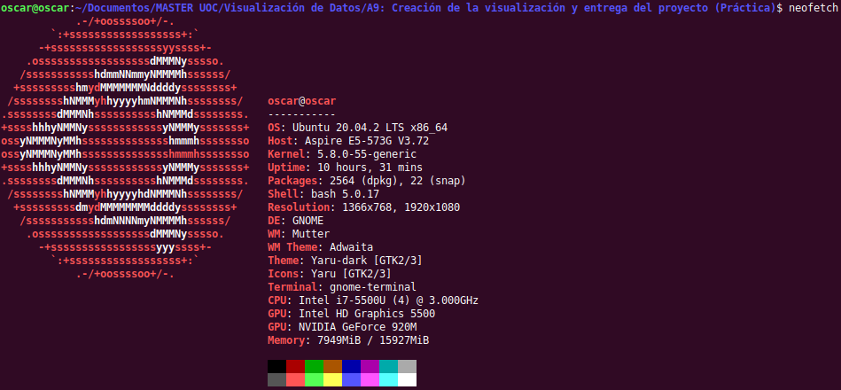
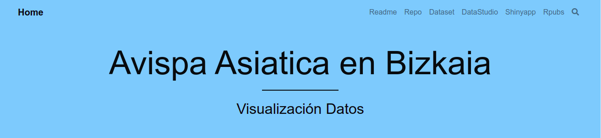

\newpage

\pagebreak  

#La Avispa Asiatica en Bizkaia 2018-2019  

### 1) Título de la visualización donde se presentan la visualización realizada. URL de la visualización y del código. Y descripción corta del documento y del que se presenta  
Presentación  

  

#### 1.1- Un título que sea autoexplicativo / descriptivo. Que contenga palabras clave. Que atraiga la atención de los lectores.  

        La Avispa Asiatica en Bizkaia 2018-2019  

#### 1.2- La URL funciona y es públicamente accesible.  

[https://zumaiauoc.github.io/vespa/](https://zumaiauoc.github.io/vespa/)  

#### 1.3 - La descripción es cuidadosa, consistente y ayuda a presentar la visualización.  

##[Descripción](https://github.com/zumaiaUOC/vespa/blob/main/index.md)  

\pagebreak

### 2) Explicar razonadamente qué preguntas responde la visualización presentada y qué uso puede tener por un usuario tipo.  
Explicación visualización   

#### 2.1- Qué visualización se ha escogido? Por qué?    

Se han escogido varias visualizaciónes y en diferentes formatos.  

Se ha realizado un Dashboard-Panel de control, con multiples filtros para obtener el número de nidos por municipio entre otras cosas.  

     

[https://oscar-rojo-martin.shinyapps.io/Vespa/](https://oscar-rojo-martin.shinyapps.io/Vespa/)     

---

Se ha generado un aplicación para mostrar en pantalla la ubicación de los nidos detectados y posteriormente el detalle de los mismos en formato tabla.  

  

[https://oscar-rojo-martin.shinyapps.io/Vespa/](https://oscar-rojo-martin.shinyapps.io/Vespa/)  

 

---

Por último se ha generado un archivo html con varias transformaciones y visualizaciones de varios datasets  

    

[https://rpubs.com/zumaia/vespa](https://rpubs.com/zumaia/vespa)    

#### 2.2- Para qué y para quién puede servir esta visualización?  
  
Para toda persona interesada en la expansión de la Avispa Asiatica en Bizkaia y para conocer muchos datos sobre ella.   
En un futuro se podría predecir la evolución de la implantación de esta especie invasora, etc...  

\pagebreak

### 3) Descripción técnica del proyecto: lenguajes, librerías, licencias, descripción técnica del proyecto.  
Descripción Técnica del proyecto:  

#### 3.1- Qué transformación de datos ha habido que  hacer respecto al juego de datos inicial?   

Se han realizado multiples transformaciones.   

  
 
Se han integrado datasets, se ha realizado limpieza de datos, se ha convertido datos en formato UTM a lat/lng. etc...  

#### 3.2- Qué lenguaje, librería, software has usado y por qué?  

El SO utilizado es Linux:  
  

Los Lenguajes de programación utilizados son:  
- Python  
- R  
- HTML  
- CSS  

Los IDEs utilizados son:  
- Pycharm  
- Jupyter Lab  
- RStudio  

\pagebreak

### 4) La/s visualizaciones realizadas  
Visualización de datos.    

  

El proyecto presentado cumple los siguientes bjetivos:  

 1- La visualización comunica bien los objetivos (título y layout).  
 2- La visualización responde las preguntas propuestas.  
 3- Interacciones presentes y con una justificación correcta.  
 4- Buena performance.  
 5- Diseño de color correcto.  
 6- Diseño de textos (títulos, leyendas...) correctos.  

  
  
  

\pagebreak

### 5) Entrega de documentos.
 
Todos los documentos estan subidos a Github. Se subirá documento con las URLs.

